# Fractal Tree Generator

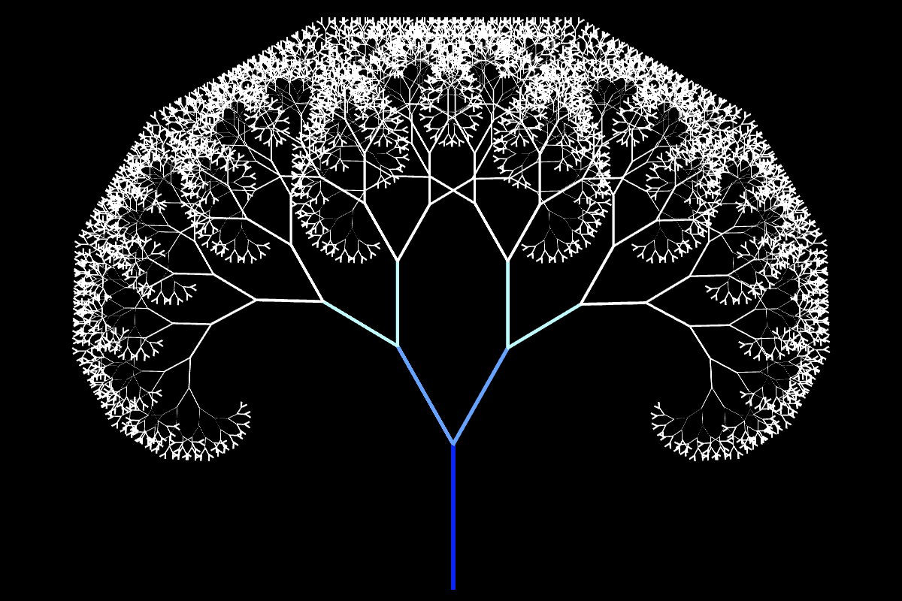

Fractal tree generator written in C++ and SFML.

## Algorithm

The fractal tree algorithm is a recursive algorithm that generates a tree-like fractal shape. Here's how it works:

1. Start with a single line segment (the "trunk") that represents the main stem of the tree.
2. At the end of the trunk, create two new line segments (the "branches") at a certain angle, length, and thickness.
   These branches will be the first level of the tree.
3. For each branch, repeat step 2 recursively. That is, at the end of each branch, create two new branches at a certain
   angle, length, and thickness. This process is repeated until a certain depth or number of iterations is reached, or
   until the length or thickness of the branches becomes too small to see.
4. As the tree branches get smaller and more numerous with each iteration, the overall shape of the tree becomes more
   complex and "fractal" in nature.

## Documentation

### Function definition

```c++
[[maybe_unused]] bool draw_fractal_tree(
        int depth,
        double length,
        double length_divider,
        double angle,
        double angle_modifier,
        double angle_randomizer_min,
        double angle_randomizer_max,
        bool angle_randomizer_flag,
        float thickness,
        float thickness_modifier,
        sf::Vector2<double> start,
        sf::Color color,
        sf::Color color_modifier
);
```

This function generates and draws a fractal tree using the specified parameters. The tree is drawn using the SFML
library. The success status indicates whether the tree was successfully drawn or not.

`depth` The depth of the fractal tree. Determines the number of recursive iterations.

`length` The length of the current branch of the fractal tree.

`length_divider` The factor by which the length of the branches decreases with each iteration.

`angle` The angle at which the branches of the tree are drawn.

`angle_modifier` The value by which the angle is modified at each recursive step.

`thickness` The thickness of the branches.

`thickness_modifier` The value by which the thickness is modified at each recursive step.

`start` The starting position of the branch.

`angle_randomizer_min` Min number for random coefficient that will affect angle of the branch each iteration.

`angle_randomizer_max` Max number for random coefficient that will affect angle of the branch each iteration.

`color` The color of the branches.

`color_modifier` The color which will be added up to previous branch's to get a color for a new one.

## Images

A few images to show the potential of this fractal tree generator.
⚠️***These trees has been generated randomly, you can get a lot more beautiful trees if you adjust settings by hand.***⚠️

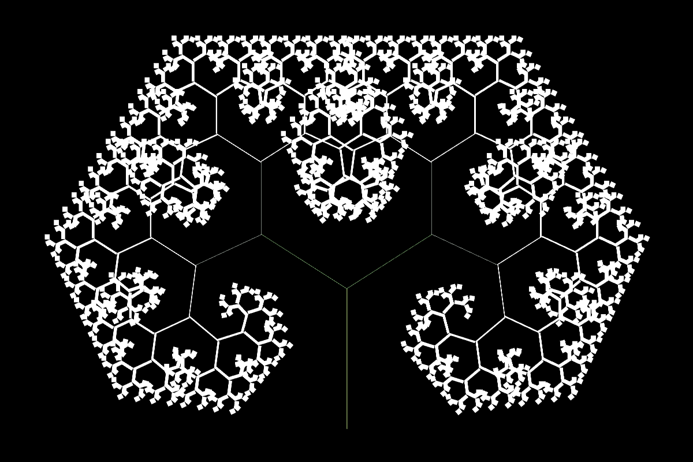
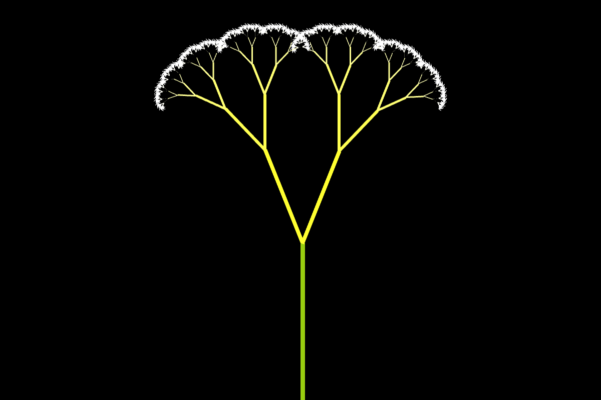
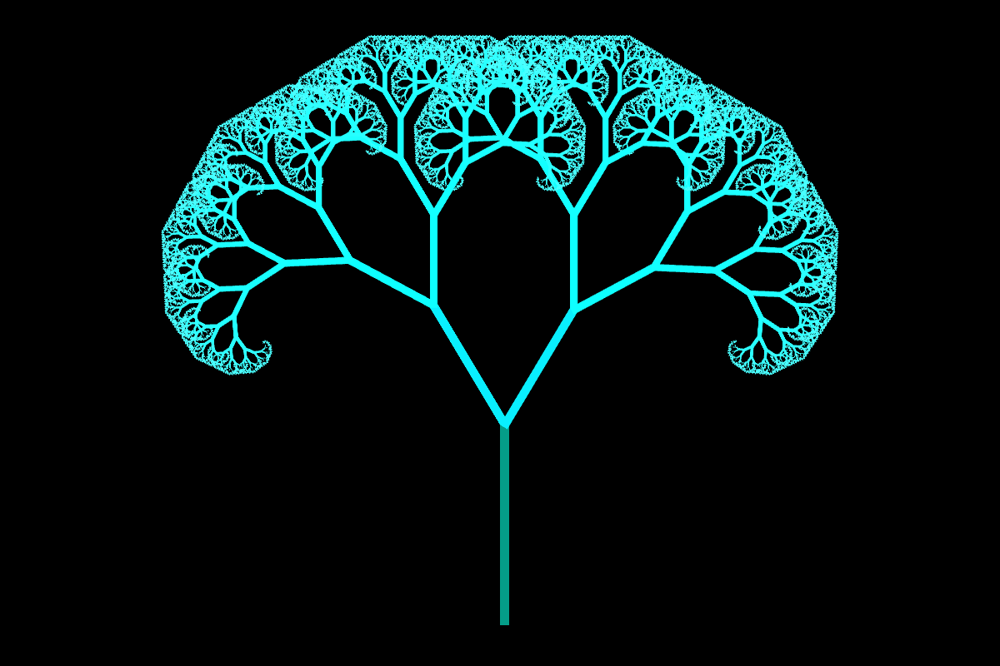

## Experiments

⚠️***Experiments has been done on previous version of the fractal tree generator.***⚠️

### Basic Tree

Let's take a look at this configuration and imagine it as a standard configuration. Next, we will change the parameters
one by one to get different results.

```c++
fractal_tree_generator.draw_fractal_tree(10,
                                         200.0,
                                         0.7,
                                         -90,
                                         25.0,
                                         1.0f,
                                         {static_cast<double>(WINDOW_WIDTH) * 0.5, WINDOW_HEIGHT - 50});
```

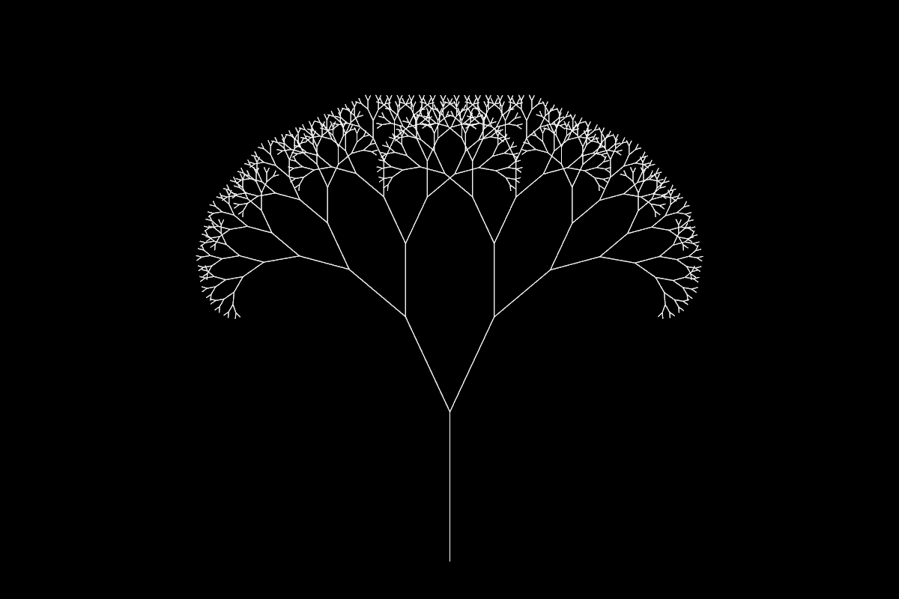

### Depth

> The depth of the fractal tree. Determines the number of recursive iterations.

```c++
fractal_tree_generator.draw_fractal_tree(15,
                                         200.0,
                                         0.7,
                                         -90,
                                         25.0,
                                         1.0f,
                                         {static_cast<double>(WINDOW_WIDTH) * 0.5, WINDOW_HEIGHT - 50});
```

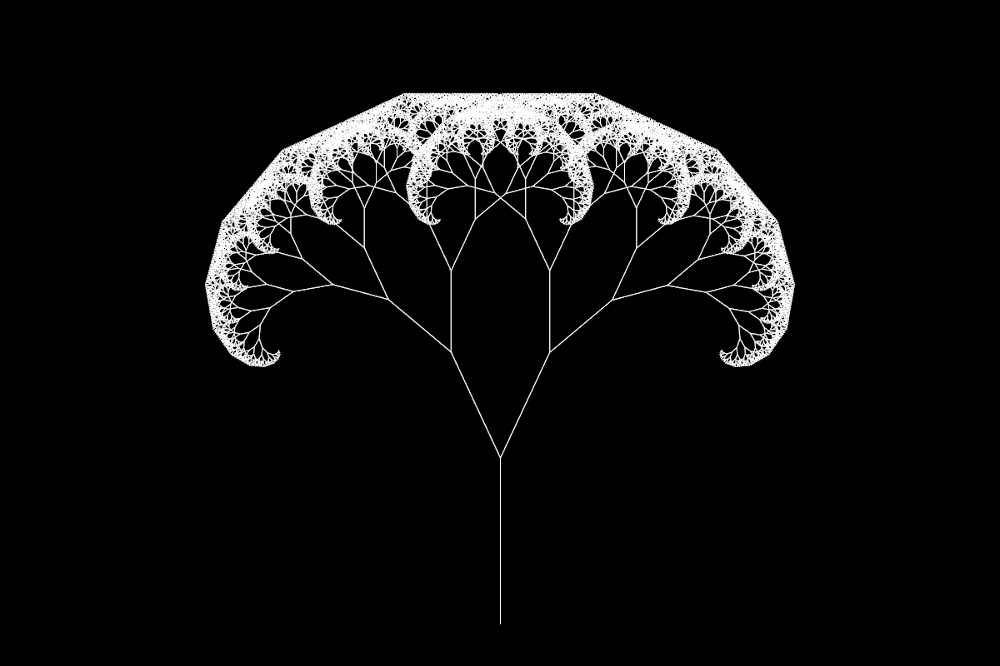

### Length

> The length of the current branch of the fractal tree.

```c++
fractal_tree_generator.draw_fractal_tree(10,
                                         100.0,
                                         0.7,
                                         -90,
                                         25.0,
                                         1.0f,
                                         {static_cast<double>(WINDOW_WIDTH) * 0.5, WINDOW_HEIGHT - 50});
```

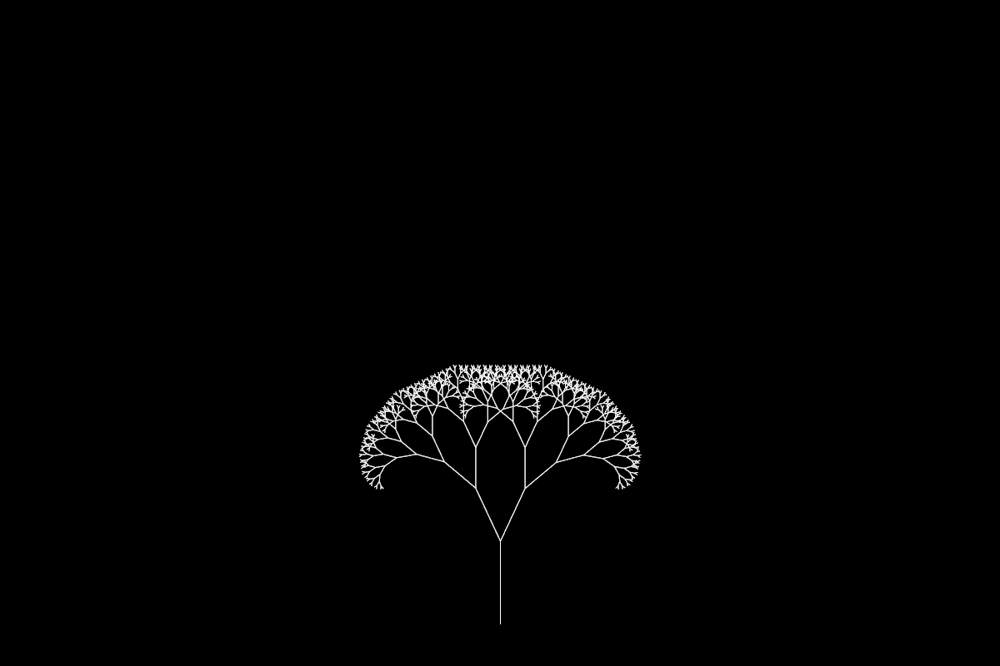

### Length divider

> The factor by which the length of the branches decreases with each iteration.

```c++
fractal_tree_generator.draw_fractal_tree(10,
                                         200.0,
                                         0.5,
                                         -90,
                                         25.0,
                                         1.0f,
                                         {static_cast<double>(WINDOW_WIDTH) * 0.5, WINDOW_HEIGHT - 50});
```

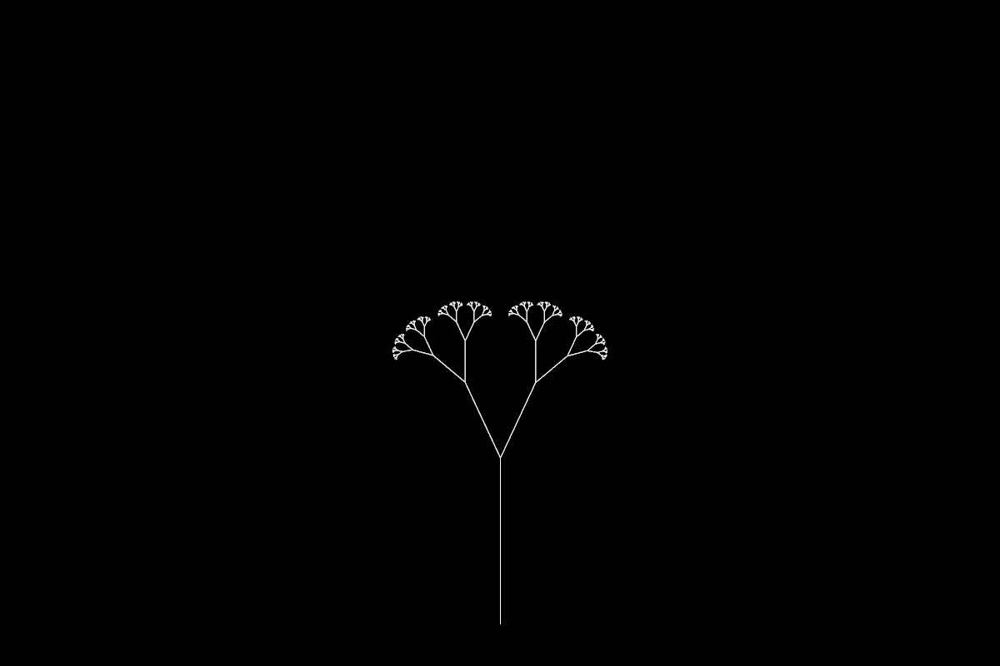

### Angle

> The angle at which the branches of the tree are drawn.

```c++
fractal_tree_generator.draw_fractal_tree(10,
                                         200.0,
                                         0.7,
                                         -45,
                                         25.0,
                                         1.0f,
                                         {static_cast<double>(WINDOW_WIDTH) * 0.5, WINDOW_HEIGHT - 50});
```

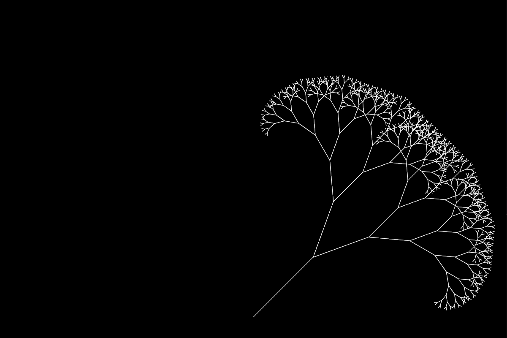

### Angle modifier

> The value by which the angle is modified at each recursive step.

```c++
fractal_tree_generator.draw_fractal_tree(10,
                                         200.0,
                                         0.7,
                                         -90,
                                         45.0,
                                         1.0f,
                                         {static_cast<double>(WINDOW_WIDTH) * 0.5, WINDOW_HEIGHT - 50});
```

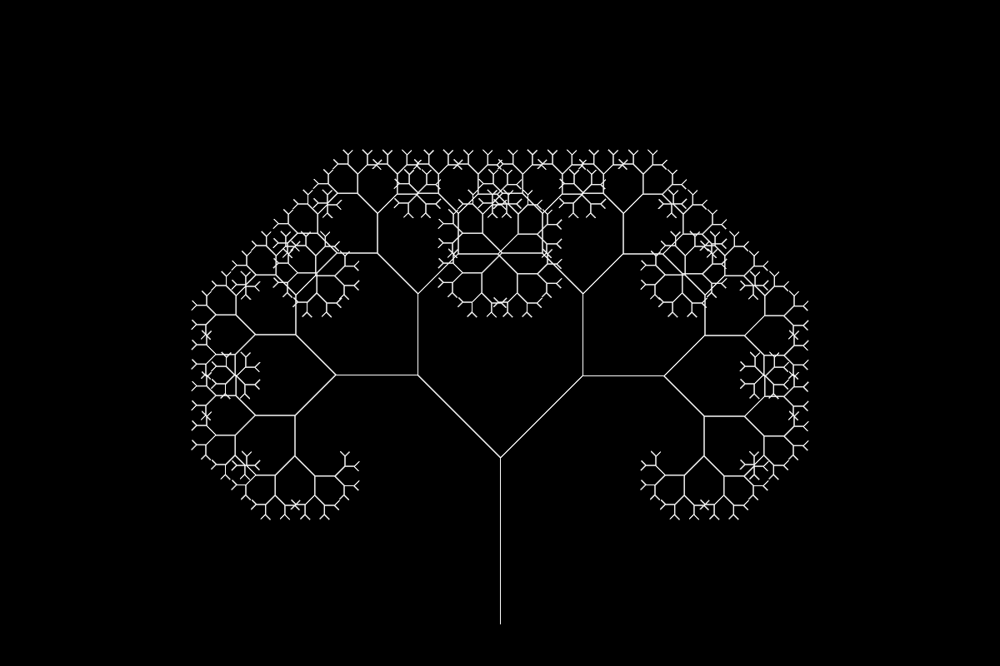

```c++
fractal_tree_generator.draw_fractal_tree(10,
                                         200.0,
                                         0.7,
                                         -90,
                                         90.0,
                                         1.0f,
                                         {static_cast<double>(WINDOW_WIDTH) * 0.5, WINDOW_HEIGHT - 50});
```

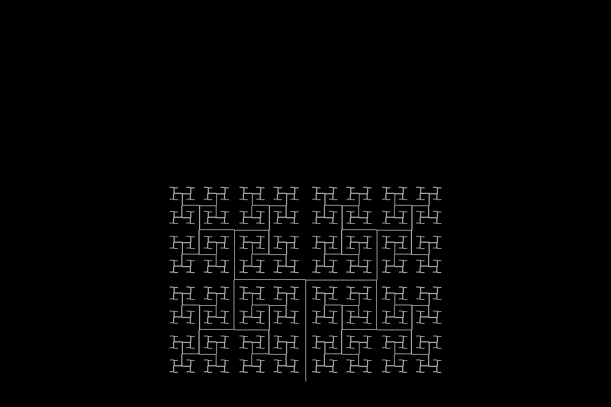

### Thickness

> The thickness of the branches.

```c++
fractal_tree_generator.draw_fractal_tree(10,
                                         200.0,
                                         0.7,
                                         -90,
                                         25.0,
                                         5.0f,
                                         {static_cast<double>(WINDOW_WIDTH) * 0.5, WINDOW_HEIGHT - 50});
```

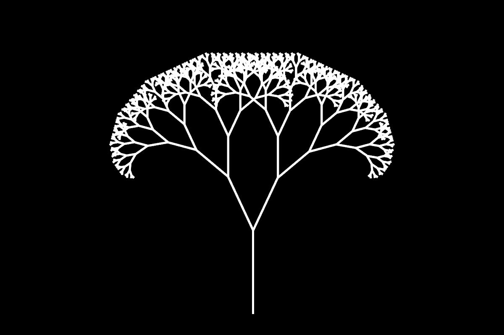

